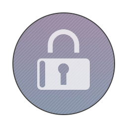
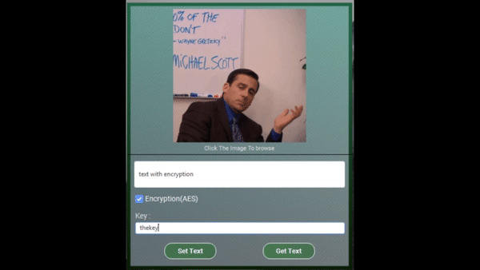
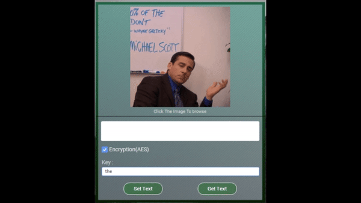
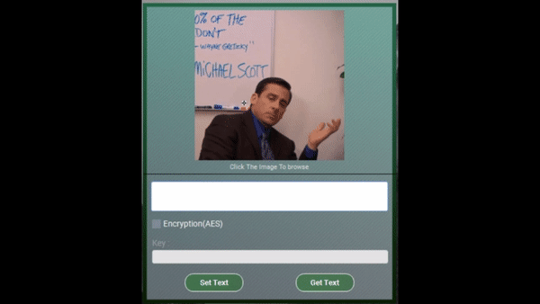
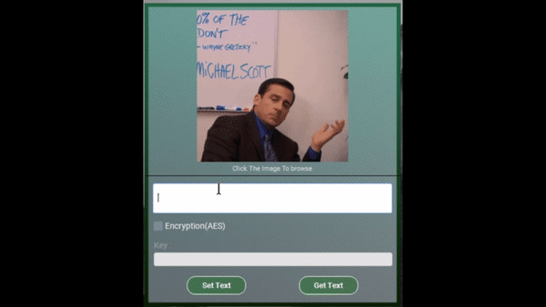
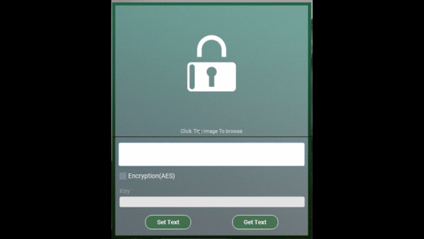

[![LinkedIn][linkedin-shield]][linkedin-url]

<!-- PROJECT LOGO -->
 

  

  <h3 align="center">secretMessage</h3>
Hide a message into an image with the option of encrypting it using AES and vice versa. 
### Built With C# 

###GIFS

 
</img>
</img>
</img>
</img>
</img>

[linkedin-shield]: https://img.shields.io/badge/-LinkedIn-black.svg?style=flat-square&logo=linkedin&colorB=555
[linkedin-url]: https://www.linkedin.com/in/it2121/

